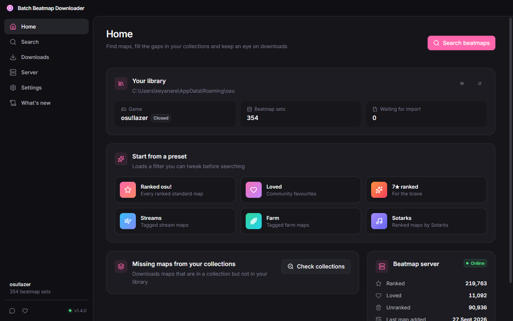
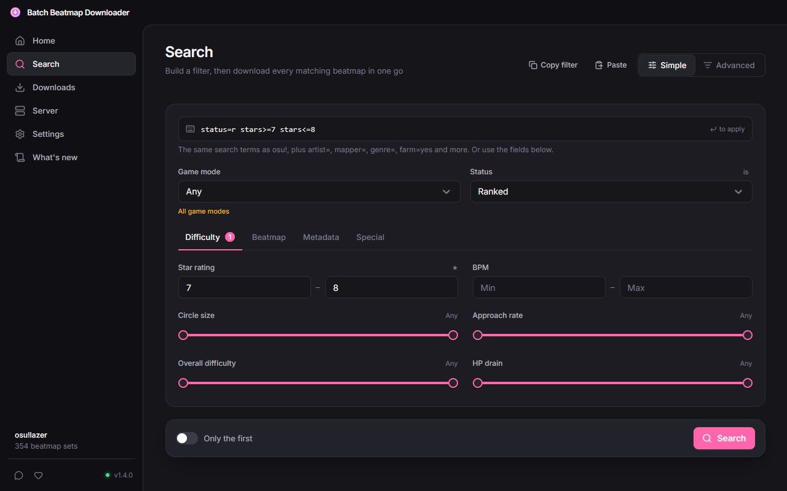
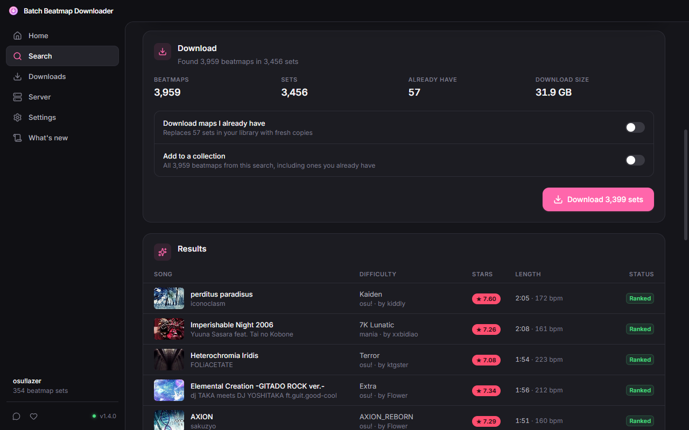
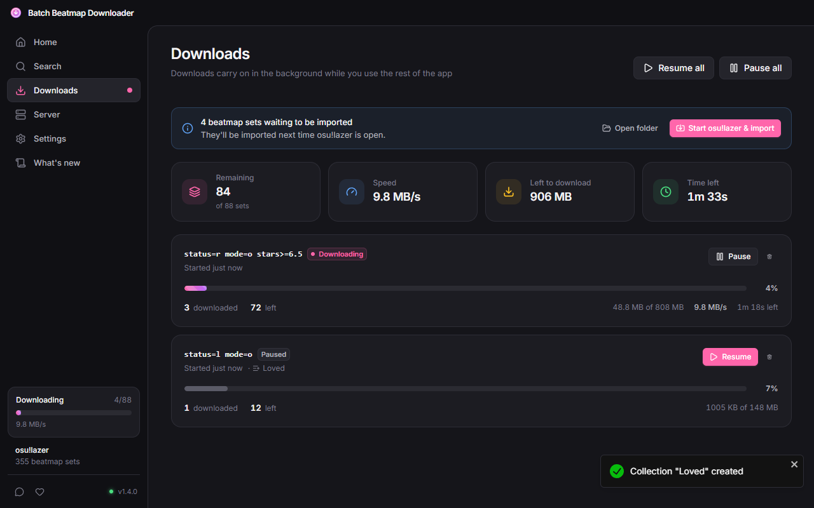

<h1 align="center">
  
  <br>
  Batch Beatmap Downloader
</h1>

<p align="center">
  Download thousands of osu! beatmaps at once, straight into <b>osu!stable</b> or <b>osu!lazer</b>.<br>Windows, macOS and Linux.
</p>

<div align="center">
  <h3><a href="https://github.com/keyanare/batch-beatmap-downloader/releases/latest">Download the latest release</a></h3>

[](LICENSE)
[](https://github.com/keyanare/batch-beatmap-downloader/releases/latest)
[](https://github.com/keyanare/batch-beatmap-downloader/releases)
[](https://github.com/keyanare/batch-beatmap-downloader/commits)

[](https://github.com/electron/electron)
[](https://github.com/facebook/react)
[](https://github.com/microsoft/TypeScript)
[](https://github.com/tailwindlabs/tailwindcss)
[](https://github.com/golang/go)

</div>

> This is a fork of [nzbasic/batch-beatmap-downloader](https://github.com/nzbasic/batch-beatmap-downloader) that adds
> osu!lazer support, a redesigned interface and a new download engine. Beatmaps still come from nzbasic's
> Batch Beatmap Downloader server, all credit for it goes to them.

<details open="open">
<summary>Table of Contents</summary>

- [About](#about)
  - [Screenshots](#screenshots)
  - [What's new in 1.4.0](#whats-new-in-140)
- [Getting Started](#getting-started)
  - [Installing](#installing)
  - [osu!lazer](#osulazer)
  - [Building yourself](#building-yourself)
- [Project structure](#project-structure)
- [Contributing](#contributing)
- [Support](#support)
- [License](#license)
- [Acknowledgements](#acknowledgements)

</details>

---

## About

Batch Beatmap Downloader provides an easy way to download a lot of osu! beatmaps matching some filter criteria.

- Mass download osu! beatmaps, for osu!stable and osu!lazer on Windows, macOS and Linux
- Filter by status, mode, star rating, BPM, AR/CS/OD/HP, length, mapper, genre, language and more
- A simple mode with osu! style search terms (`status=r mode=o stars>=6.5 artist="camellia"`) and an advanced mode with AND / OR / NOT and nested groups
- Preset filters and shareable filters
- Custom tags on maps to search by (farm, stream, ranked mapper, tournament slots)
- Maps you already have are skipped
- Add downloaded maps to a new or existing collection
- Download maps that are missing from your collections
- Pause, resume and retry failed maps; downloads carry on after restarting the app

### Screenshots

<p align="center">
  
  
  
  
</p>

### What's new in 1.4.0

**osu!lazer support**

- Pick osu!stable or osu!lazer; your game folders are found automatically
- Downloaded maps are imported straight into osu!lazer, while it's open or the next time it starts
- Maps you already have in osu!lazer are skipped, collections work too

**Downloads**

- New built-in downloader, no separate program is downloaded anymore
- Many older files on the download server are stored wrapped in the form data they were uploaded with; the game can't read those. They are now unwrapped automatically, so those maps actually work
- Server errors are no longer saved as corrupt `.osz` files, and failed maps are reported as failed instead of completed
- Pausing no longer leaves half written `.osz` files behind
- Live progress, speed and time left; downloads wait for the server and resume on their own if it goes down

**Everything else**

- Completely redesigned interface with light and dark themes and a proper window title bar
- Collections are only written while the game is closed, so osu! can't overwrite them, and long collection names no longer corrupt `collection.db`
- Lots of search fixes: the text query keeps "contains" filters, understands quotes, pasted filters show up in the advanced editor, filters with non-English characters can be copied
- Updated from Electron 13 to Electron 44

The full list is in the app under "What's new".

## Getting Started

### Installing

You need [osu!](https://osu.ppy.sh), either osu!stable or osu!lazer, and have to have run it at least once. Download the app for your system from the [latest release](https://github.com/keyanare/batch-beatmap-downloader/releases/latest), then choose your game on the home screen. The app usually finds its folder on its own.

**Windows**: run `BBDWindowsSetup.exe`. It updates an existing installation of the original app, and updates itself from then on. The installer isn't code signed, so SmartScreen may warn about it the first time (More info → Run anyway).

**macOS**: open the `.dmg` for your Mac (`arm64` for Apple Silicon, `x64` for Intel) and drag the app into Applications. It isn't notarized by Apple, so the first time macOS will refuse to open it: go to System Settings → Privacy & Security and click "Open Anyway". Or run `xattr -dr com.apple.quarantine "/Applications/Batch Beatmap Downloader.app"` once.

**Linux**: use the `.AppImage` (`chmod +x` it and run it) or install the `.deb` on Debian/Ubuntu based distributions.

On macOS and Linux the app tells you when a new version is out, but doesn't update itself.

osu!stable running through wine works too. The app looks in the usual places (osu-winello, `~/.wine`, Lutris); otherwise choose the `osu!` folder inside your wine prefix.

### osu!lazer

osu!lazer keeps its maps in a database instead of a Songs folder, so downloaded maps are handed to the game to import, the same way double clicking an `.osz` file does:

- While osu!lazer is open, maps are imported as soon as they finish downloading.
- While it's closed, they wait in a folder and are imported the next time the game is open, or right away with "Start osu!lazer & import".
- Maps you already have in osu!lazer are skipped. The database is only ever read from a temporary copy.
- Collections are written into osu!lazer's database only while the game is closed, after saving a backup as `client.realm.bbd-backup` next to it. If the game is open, the collection is created as soon as you close it.

### Building yourself

Requires Node.js 22 or newer. Building for Linux also needs `squashfs-tools` (for the AppImage), `dpkg` and `fakeroot`; building for macOS has to happen on a Mac.

```bash
cd client
npm install
npm start      # run in development mode
npm run make   # build installers for the current system into client/out/make
```

`npm run typecheck` and `npm run lint` check the code. Development builds keep their settings in a separate folder, so they don't interfere with an installed copy.

GitHub Actions builds every platform for each pull request. Pushing a version tag (`v1.5.0`) collects the Windows, macOS (Apple Silicon and Intel) and Linux builds into a draft release.

## Project structure

| Folder | What's in it |
| --- | --- |
| `client/src/app` | Electron main process: settings, downloads, osu!stable and osu!lazer libraries, server API |
| `client/src/bridges` | Preload bridge between the main process and the interface |
| `client/src/render` | The React interface |
| `client/src/models` | Types and filter logic shared by both sides |
| `api` | The Go server behind the search and download endpoints (run by nzbasic) |
| `download` | The Go downloader used by versions before 1.4 |
| `.github/workflows` | Builds for every platform and draft releases |

## Contributing

Bug reports and pull requests are welcome in the [issues](https://github.com/keyanare/batch-beatmap-downloader/issues). Please try to create bug reports that are:

- _Reproducible._ Include steps to reproduce the problem.
- _Specific._ Include as much detail as possible: which version, osu!stable or osu!lazer, what environment, etc.
- _Unique._ Do not duplicate existing opened issues.
- _Scoped to a Single Bug._ One bug per report.

## Support

For problems with this fork, open an [issue](https://github.com/keyanare/batch-beatmap-downloader/issues).

Batch Beatmap Downloader was created by nzbasic, who also runs the beatmap server everyone downloads from. If the app is useful to you, consider supporting them:

[](https://www.buymeacoffee.com/nzbasic)

## License

This project is licensed under the **MIT license**. Feel free to edit and distribute the code as you like.

See [LICENSE](LICENSE) for more information.

## Acknowledgements

- [nzbasic](https://github.com/nzbasic) for creating Batch Beatmap Downloader and running its server
- [ppy/osu](https://github.com/ppy/osu) for osu!lazer, whose source made the lazer integration possible
- [Realm](https://github.com/realm/realm-js) for reading osu!lazer's database
- [Lucide](https://lucide.dev) for the icons
- [amazing-github-template](https://github.com/dec0dOS/amazing-github-template) for the original readme template
